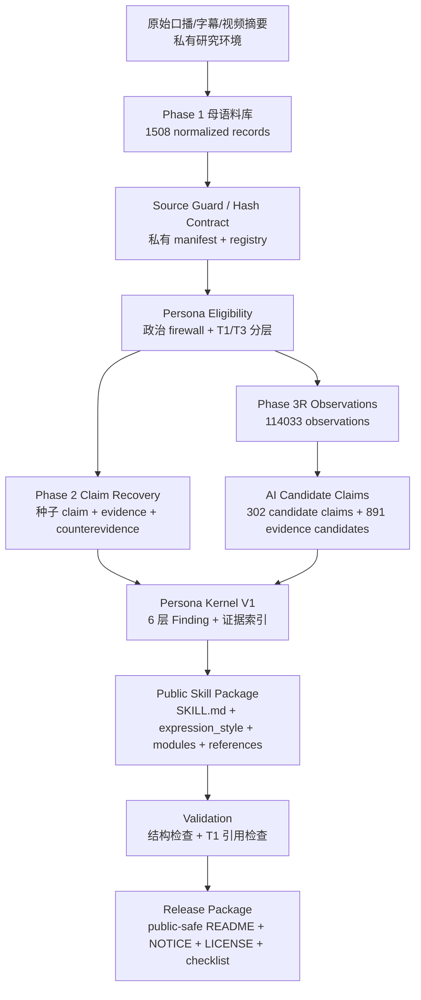

# Production Flow · public-safe 大老王 Skill

> 生成：2026-08-23 | 用途：说明公开包如何参考 `nihaixia` 成品结构与 `tcm-distiller` 方法论。本文只描述蒸馏流程，不包含原始语料、私有哈希、来源登记表或逐字稿摘录。

## 1. 参考对象

`jangviktor-web/nihaixia` 是成品形态参考：

- `SKILL.md` 做总入口。
- `expression_style.md` 单独承载表达 DNA。
- `modules/` 承载大块知识和可检索内容。
- `cases/` 承载案例库。
- `references/` 承载研究、证据、审计与速查层。

`jangviktor-web/tcm-distiller` 是方法论参考：

- Phase 0：确认人物类型与输入来源。
- Phase 1：多维并行调研。
- Phase 2：合成 Skill 框架。
- Phase 3：质量验证与覆盖率检查。
- Phase 4：增量补充缺口。
- Phase 5：交付。

## 2. 大老王项目的 public-safe 数据流



## 3. 当前公开包结构

```text
laowang-skill-public/
├── SKILL.md
├── expression_style.md
├── README.md
├── NOTICE.md
├── LICENSE
├── RELEASE_CHECKLIST.md
├── cases/
├── modules/
│   ├── 01-core-worldview.md
│   ├── 02-life-decisions.md
│   ├── 03-expression-playbook.md
│   ├── 04-family-education.md
│   ├── 05-finance-business.md
│   └── 06-metaphysics-fate.md
├── references/
│   ├── production-flow.md
│   ├── evidence/
│   │   └── public_evidence_note.jsonl
│   └── research/
│       ├── 01-core-worldview.md
│       ├── 02-decision-heuristics.md
│       ├── 03-value-hierarchy.md
│       ├── 04-expression-dna.md
│       ├── 05-boundaries-tensions.md
│       ├── 06-audience-faq.md
│       ├── 07-phase3r-addendum.md
│       ├── 08-expression-signal-audit.md
│       ├── 09-phase3r-kernel-v2-addendum.md
│       ├── 10-family-education-module.md
│       ├── 11-finance-business-module.md
│       └── 12-metaphysics-fate-module.md
└── evaluations/
    ├── routing_matrix_v1.md
    ├── integrated_pressure_test_outputs.md
    └── public_release_check.md
```

## 4. 与 tcm-distiller 的差异

大老王项目不是中医知识 Skill，因此没有方剂、剂量、临床安全层等维度。本草稿改成：

- 核心世界观
- 决策启发式
- 价值排序
- 表达 DNA
- 边界与张力
- 受众模型与 FAQ

另外，大老王原始语料大量涉及政治内容。本项目已有 politics firewall，所以当前 Skill 草稿默认做非政治 persona，不把政治观点包装成可模仿人格核心。

## 5. 下一步

当前 V1 已从“成品骨架”推进到“可路由 public-safe Skill”：已具备表达层、人生决策、家庭教育、金融商业、玄学命运、公开证据说明和综合压力测试。发布后仍可继续迭代：

- 对完整 T1 段落做盲评，检查输出是否真的像口播风格。
- 建立 cases/ 案例库，把代表性问答从 smoke test 升级为可复用案例。
- 做表达相似度盲评。
- 做多轮对话重复口头禅检查。
- 决定是否另建“政治观点研究模式”，不要混入 persona 默认模式。
- 决定是否安装为本地 Codex Skill 或继续作为 GitHub 公开包迭代。
